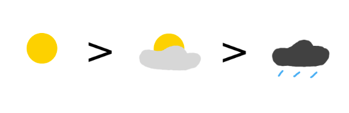
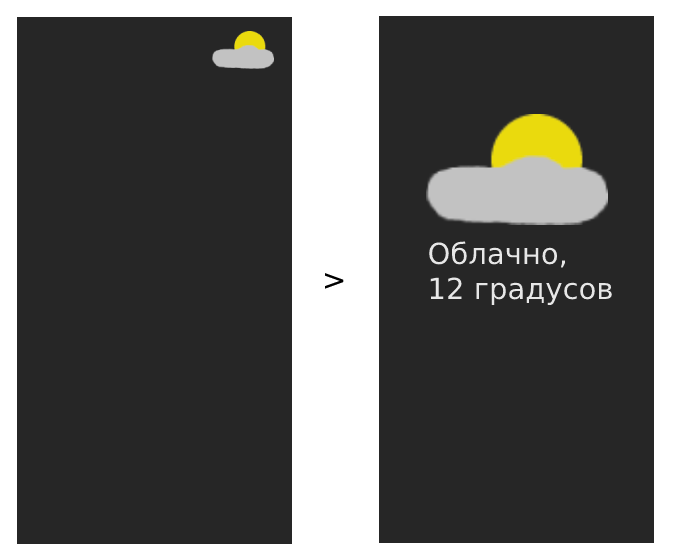

# advanced_widgets

Научиться работать с Widget-ами и использовать Inherited Widget. 

## Что нужно сделать

* [x] Главный цвет приложения должен зависеть от текущего профиля (Цвет header, кнопок, заголовков и так далее). Реализовать эту возможность нужно с помощью Inherited Widget. Реализуйте возможность смены профиля с мгновенной сменой основного цвета приложения. Количество цветов — на ваш выбор.

* [x] Реализуйте виджет, который представляет собой иконку текущей погоды. Данный виджет имеет два крайних состояния: очень облачно с дождём и ясно. Виджет имеет один (или более) обязательный параметр, который отвечает за его состояние. К примеру, он может принимать число от 0 до 1 и, в зависимости от него, выводить соответствующую иконку, как в примере ниже (максимально похоже).

  

  Когда значение облачности равно нулю, должно выводиться солнце. Если значение 0.5 — выводится облако, которое закрывает солнце. При значении 1 выводится сильная облачность и дождь. Картинки должны плавно перетекать одна в другую: если значение облачности равно 0.2, то облако начинает проявляться и обретать непрозрачность. Таким образом будет возможность добавить WeatherIndicator(0.8) в приложение, что и нужно сделать.

* [x] Реализуйте возможность масштабирования погоды. Когда пользователь нажимает на иконку погоды, она увеличивается и появляется больше текстовой информации.
  

* [x] Используя renderObject, создайте виджет, который каким-либо образом декорирует текст (добавляет к нему тень, эффекты). Используйте такой текст в приложении.

### Демонстрация

https://github.com/skillbox-koutja/advanced_widgets/res/demo.mov